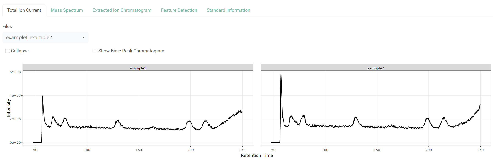

```{r, include = FALSE}
knitr::opts_chunk$set(
  collapse = TRUE,
  comment = "#>",
  eval = FALSE
)
```

The goal of '**LCMSQA**' is to make it easy to check the quality of liquid
chromatography/mass spectrometry (LC/MS) experiments using a
'**[shiny](https://cran.r-project.org/package=shiny)**' application. It uses the
R package '**[xcms](https://bioconductor.org/packages/xcms/)**' workflow for
data import, visualization, and feature detection of internal standards or known
metabolites that can be used to evaluate and adapt the peak detection settings.

## Installation

In R session, please type

```{r install}
## Install from CRAN
install.packages("LCMSQA")

## Load LCMSQA pacakge
library(LCMSQA)
```

## Parallel Processing

Most methods in `xcms` support parallel processing via
'**[BiocParallel](https://bioconductor.org/packages/BiocParallel/)**' to save
time. We highly recommend to initiate the parallel processing setup explicitly
before starting the app.

To initiate `multicore`-based parallel evaluation in Unix-based systems
(e.g., Linux, macOS),

```{r unix parallel}
## Unix-based systems
library(BiocParallel)
register(bpstart(MulticoreParam()))
```

On Windows, `MulticoreParam` results in serial evaluation. Please use
`SnowParam` instead.

```{r windows parallel}
## Windows system
library(BiocParallel)
register(bpstart(SnowParam()))
```

For other options and details, please check the `BiocParallel` package
vignettes.

## Shiny App

Launch the shiny app with

```{r shiny app}
runQA()
```

The system's default web browser will be launched automatically after the app is
started.

## Example Data

The example data used in this vignette can be downloaded from the following
links:
[example1.mzML](https://github.com/HimesGroup/LCMSQA/raw/main/inst/examples/example1.mzML),
[example2.mzML](https://github.com/HimesGroup/LCMSQA/raw/main/inst/examples/example2.mzML),
and
[IS_info.csv](https://github.com/HimesGroup/LCMSQA/raw/main/inst/examples/IS_info.csv)
(right click -> save link as).

## File Input

The app needs the following input:

1. (required) mass-spectrometry data files of quality control (QC) samples in
  open formats: AIA/ANDI NetCDF, mzXML, mzData and mzML

Check
'**[msconvert](https://proteowizard.sourceforge.io/tools/msconvert.html)**' if
you have data in different formats. Multiple files can be selected.


{width=80%}

2. (optional) internal standard information (or other known metabolites) in a CSV
  format with the columns:
  + compound: the name of compound
  + adduct: adduct type (e.g., [M+H]+)
  + mode: must be either "positive" or "negative"
  + mz: a known mass-to-charge ratio (m/z) value

You will see the menu to upload a CSV file after uploading mass-spectrometry
files. You can skip this step and specify mass-to-charge ratio (m/z) manually to
explore metabolic features of interest.


{width=80%}

## Tuning Parameters

You can tune multiple parameters for metabolic feature detection (peak picking +
grouping).

{width=80%}

### 1. Set m/z and retention time of interest

 - compound (or m/z) with a ppm tolerance
 - retention time in second (min, max)

### 2. Peak picking using the [centWave](https://sneumann.github.io/xcms/reference/findChromPeaks-centWave.html) method

- ppm: the maximal tolerated m/z deviation in consecutive scans in ppm for the
   initial region of interest (ROI) definition
- peak width: the expected approximate peak width in chromatographic space
- signal/noise cut: the signal to noise ratio cutoff
- m/z diff: the minimum difference in m/z dimension required for peaks with
  overlapping retention times
- noise: a minimum intensity required for centroids to be considered in the
  first analysis step
- prefilter (>= peaks, >= intensity): the prefilter step for the first
  analysis step (ROI detection)
- Gaussian fit: whether or not a Gaussian should be fitted to each peak
- m/z center: the function to calculate the m/z center of the chromatographic
  peaks
- integration: whether or not peak limits are found through descent on the
  Mexican Hat filtered data

### 3. Peak grouping using the [peak density](https://sneumann.github.io/xcms/reference/do_groupChromPeaks_density.html) method

- bandwidth: the bandwidth (standard deviation of the smoothing kernel) to be
  used
- min fraction: the minimum fraction of samples in which the peaks has to be
  detected to define a peak group
- bin size: the size of overlapping slices in m/z dimension

## Tabs

The application consists of four main tabs:

- Total Ion Current (TIC) Chromatogram
- Mass Spectrum
- Extracted Ion Chromatogram (XIC)
- Metabolic Feature Detection

### 1. TIC

This is the default tab that is opened once you upload the files. The TIC
chromatogram shows the summed signals over the entire range of masses.
Alternatively, base peak chromatogram can be displayed to monitor the most
intense signal in each spectrum. The **Collapse** checkbox is used to display
the chromatograms of multiple files in one figure.

{width=100%}

### 2. Mass Spectrum

In this tab, a mass spectrum is presented in which the most intense ion is
re-scaled to an abundance of 100. If you click any data point within a
chromatogram on top, a mass spectrum of the given scan time will be
automatically displayed.

{width=100%}

### 3. XIC

For a specific slice of m/z and retention time ranges, clicking **Generate XIC**
in the sidebar panel generates plots where each figure shows an XIC on top and
m/z variation against retention time on bottom. You can choose a subset of files
to display from the dropdown menu.

{width=100%}

### 4. Feature Detection

If you click **Detect Features** in the sidebar panel, chromatographic peak
detection is performed using the centWave method and identified peaks are
grouped into a feature. This tab shows apex positions of m/z and retention time
values within the feature on the left and integrated peak areas on the right
using a bar plot. Relative standard deviation (RSD) is calculated to measure the
reproducibility among QC samples. A RSD value is not calculated if there is any
missing value in the integrated peak area. In that case, you can exclude samples
with missing values from the dropdown menu.

{width=100%}

## References

1. Smith, C.A. and Want, E.J. and O'Maille, G. and Abagyan,R. and Siuzdak, G.:
   XCMS: Processing mass spectrometry data for metabolite profiling using
   nonlinear peak alignment, matching and identification, Analytical Chemistry,
   78:779-787 (2006)

2. Ralf Tautenhahn, Christoph Boettcher, Steffen Neumann: Highly sensitive
   feature detection for high resolution LC/MS BMC Bioinformatics, 9:504 (2008)
